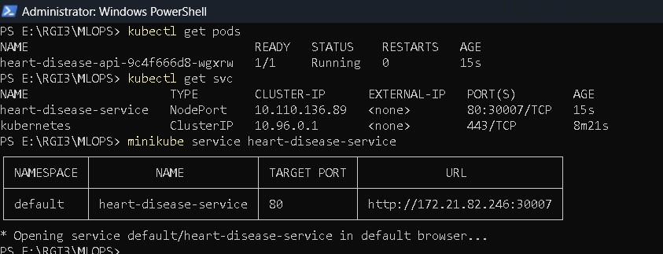
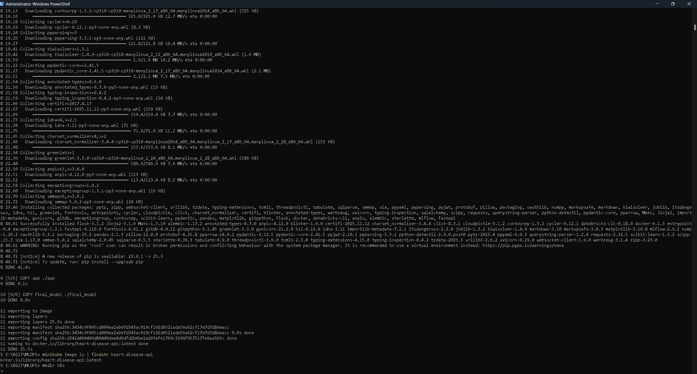
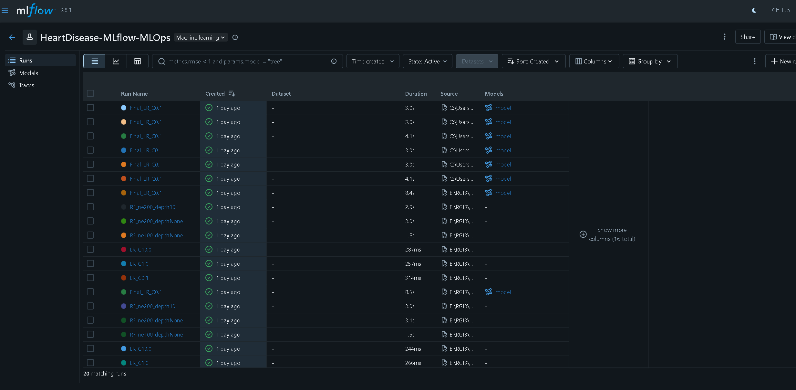
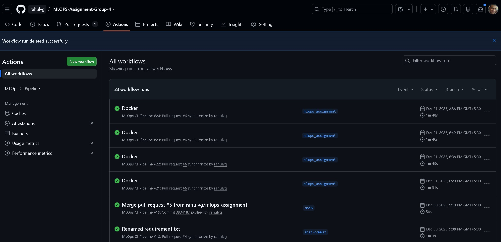
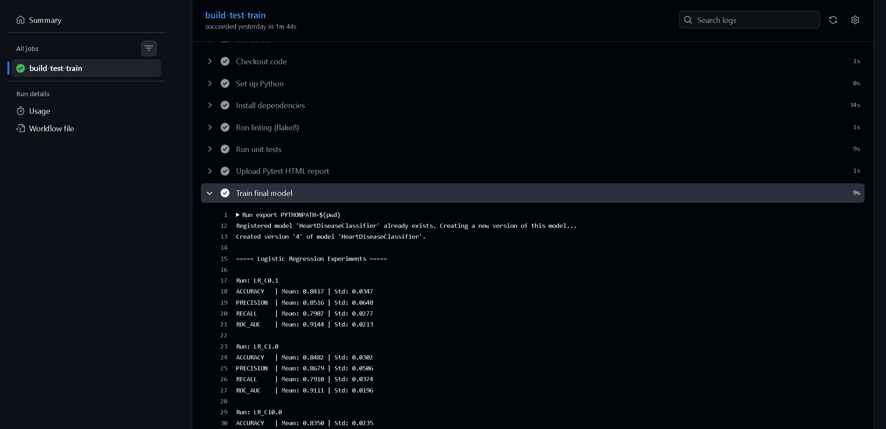
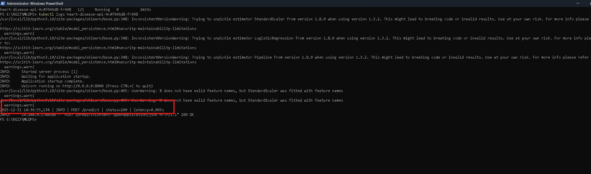
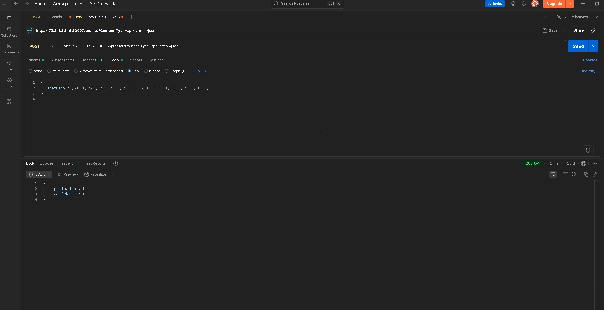

# Heart Disease Prediction System – MLOps

**Course:** MLOps  
**Assignment:** End-to-End MLOps Pipeline  
**Dataset:** UCI Heart Disease Dataset  
**Group:** Group 41  
**Repository:** https://github.com/rahulvg/MLOPS-Assignment-Group-41-

---

##  Problem Statement

The objective of this project is to design, develop, and deploy a scalable, reproducible, and production-ready machine learning system to predict the presence of heart disease based on patient health attributes.

The solution follows modern MLOps best practices, including experiment tracking, CI/CD automation, containerization, Kubernetes deployment, and monitoring.

---

## 1. Setup and Installation Instructions

### 1.1 Local Environment

**Python Version:** 3.10

**Install Dependencies**

    pip install -r requirements.txt

**Run Training File(Runs experiment with different parameter on Logistics Regression and Random forest)** 

    python train/train_experiment.py

**Run all unit tests using Pytest**

    pytest

Create report using pytest

    pytest --html=pytest_report.html

**Launch MLflow UI (Local SQLite DB)**

    mlflow ui --backend-store-uri sqlite:///mlflow.db

Access MLflow at:

    http://localhost:5000

---
### 1.2 Verification of Docker Build and Execution via GitHub Actions

Due to organizational restrictions that prevent local installation of Docker Desktop, the Docker image build and container execution were verified using **GitHub Actions**, which provides a Docker-enabled runner environment.

This ensures that containerization and execution are **reproducible, verifiable, and independent of local system constraints**.

---

1. Navigate to the GitHub repository:  
   https://github.com/rahulvg/MLOPS-Assignment-Group-41-

2. Click on the **Actions** tab in the repository.

3. Select the most recent workflow run under the **CI pipeline**.

4. Open the workflow run and inspect the following steps:

   - **Build Docker image**  
     This step executes the Docker build command using the project’s `Dockerfile`.

   - **Run Docker container and test API**  
     This step starts the container and invokes the `/predict` endpoint using a sample JSON request.

---

## Evidence of Successful Docker Execution

Within the GitHub Actions workflow logs, the following evidence can be observed:

- Docker build logs confirming successful image creation  
- Container startup logs indicating the FastAPI service is running  
- Successful HTTP response from the `/predict` endpoint returning a prediction and confidence score  

---

## Screenshot of successfull Docker run event

---
### 1.3 Kubernetes (Local Deployment with Minikube)

**Start Minikube**

    minikube start --container-runtime=containerd

**Build Docker Image Inside Minikube**

    minikube image build -t heart-disease-api .

**Deploy Application**

    kubectl apply -f k8s/deployment.yaml
    kubectl apply -f k8s/service.yaml

**Expose Service**

    minikube service heart-disease-service

---

## 2. Data Acquisition and Exploratory Data Analysis

### 2.1 Dataset

- Source: UCI Machine Learning Repository  
- Format: CSV  
- Task: Binary classification (presence or absence of heart disease)

### 2.2 Preprocessing

- Missing values handled  
- Numerical features scaled using StandardScaler  
- Target variable encoded  
- Preprocessing implemented using a scikit-learn Pipeline  

### 2.3 Exploratory Data Analysis (EDA) & Modelling choice

- Feature distributions analyzed using histograms  
- Correlation heatmap used to study feature relationships  
- Class balance verified  

The modelling approach was guided by dataset characteristics, interpretability needs, and deployment stability.

Two models were evaluated:

- **Logistic Regression** – chosen as a strong, interpretable baseline for structured medical data  
- **Random Forest** – included to capture non-linear relationships and feature interactions  

All numerical features were standardized using **StandardScaler**, and preprocessing was implemented through a unified **scikit-learn Pipeline** to ensure reproducibility, prevent data leakage, and enable deployment-safe inference.

#### Hyperparameter Tuning
- Logistic Regression: `C ∈ {0.1, 1.0, 10.0}`
- Random Forest:  
  - `n_estimators ∈ {100, 200}`  
  - `max_depth ∈ {None, 10}`  

Each configuration was logged as a separate experiment using **MLflow**.

#### Evaluation
Models were evaluated using **5-fold cross-validation** with the following metrics:
- Accuracy
- Precision
- Recall
- ROC-AUC

#### Final Model
**Logistic Regression with C = 0.1** was selected due to:
- Consistent cross-validation performance
- Lower variance across folds
- Better generalization
- Simpler and more interpretable behavior

Its stability and ease of monitoring make it well-suited for a production-oriented MLOps pipeline.

---

## 3. Experiment Tracking

MLflow was integrated to track:

- Model parameters  
- Cross-validation metrics  
- Model artifacts  

All experiments are logged under a dedicated MLflow experiment for easy comparison.

---

###  Model Packaging and Reproducibility

- Final model saved as a serialized scikit-learn Pipeline  
- Model can be found at  **final_model\heart_disease_lr_c01.pkl** in git repo.
- Preprocessing included within the model  
- Reproducible inference guaranteed  
- Dependencies listed in requirements.txt  
- Artifacts stored and versioned using MLflow check **mlflow_experiment.db** in git repo 

---
## 4. Architecture Diagram 

---

## 5. CI/CD Pipeline

### Tools Used

- GitHub Actions  
- Pytest  
- Flake8  
- Docker  

### Pipeline Stages

- Code linting  
- Unit testing  
- Model training  
- Docker image build  
- API smoke testing  

---

## 6. Code Repository

https://github.com/rahulvg/MLOPS-Assignment-Group-41-

## 7. Containerization and Deployment

### 7.1 Dockerized API

- FastAPI-based service  
- /predict endpoint  
- Accepts JSON input  
- Returns prediction and confidence score  

### 7.2 Kubernetes Deployment

- Local Kubernetes using Minikube  
- Deployment and NodePort Service manifests  
- API tested using curl and Postman  

---

## 7. Monitoring and Logging

### 7.1 Logging

- Request-level logging implemented via FastAPI middleware  
- Logs include endpoint, HTTP status, and latency  
- Logs accessible via Kubernetes pod logs  

### 7.2 Monitoring

- Prometheus-compatible /metrics endpoint exposed  
- Metrics include request count and request latency  
- Ready for Prometheus and Grafana integration  

---

## 8. Architecture Overview

Client (Postman / curl)  
→ FastAPI API (/predict, /metrics)  
→ Scikit-learn Pipeline  
→ Kubernetes Pod  
→ NodePort Service  

CI/CD is handled using GitHub Actions, and experiment tracking is handled using MLflow.

---

## 9 Run using CURL/Postman API 

Curl Command 

    "curl -X POST http://127.0.0.1:30007/predict \
    -H "Content-Type: application/json" \
    -d '{"features":[63,1,145,233,1,0,150,0,2.3,0,0,1,0,0,1,0,0,1]}'"

---

## Conclusion

This project demonstrates a complete, production-grade MLOps workflow covering data analysis, model development, experiment tracking, CI/CD automation, containerization, Kubernetes deployment, and monitoring.

The system is scalable, reproducible, and aligned with real-world MLOps practices.

---
## Demo video 
https://github.com/rahulvg/MLOPS-Assignment-Group-41-/blob/main/Demo%20Video.mp4
---

## Appendix: Useful Commands

**Launch MLflow with Custom Local DB**

    mlflow ui --backend-store-uri sqlite:///E:/RGI3/MLOPS/mlflow.db

**Rebuild and Redeploy on Minikube**

    minikube image build -t heart-disease-api .
    kubectl delete deployment heart-disease-api
    kubectl apply -f k8s/deployment.yaml

